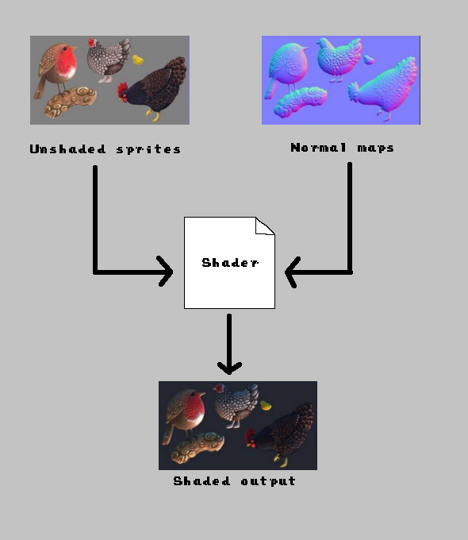

# Flixel Frame Buffer

This repo shows a way I found to get a "frame buffer" for a full-screen shader.
The particular use-case here is a dynamic lighting shader, but the same concept here could be used for any shader that would benefit from secondary `BitmapData` as input.

## TOC
- [Concept](#concept)
- [Example](#example)
- [Implementation](#implementation)
- [Limitations](#limitations)

## Concept

This dynamic lighting shader has 3 pieces:
1. The unshaded game render
   1. All the base sprites on screen in their raw state in the game as seen by the camera
2. The normal map data
   1. The normal data of all sprites as seen by the camera
3. Lighting information
   1. Any lights in the environment and their position relative to the current view of the camera
   2. Ambient lighting to provide a base level of illumination

The shader code itself will consume all of this information and provide the final rendered frame to show on screen.

## Example

The underlying unshaded rotating diamond sprite sheet

The normal map data. This one was crafted by hand, but there are various tools out there to help with creating normal maps.

The final product with the animation playing and a light inserted into the scene.

## Implementation

The idea here is to make use of the capabilities of `FlxCamera` to render our composite images that the Shader will use.

The standard Flixel code path renders all cameras sequentially with no way to add processing between different camera render calls. To get around this, I make use of a second `CameraFontEnd`. This is a little hacky, but this lets us render our normal map composite image and pass that data into our shader so that it is accurate to the composite image of our unshaded sprites.
> **_NOTE:_** Just using the cameras as Flixel does by default would yield a composite normal image that is always one frame behind what the state of the game currently is.

There are a few uses of `@access` here in order to be able to render cameras in the order we want. The key here is that we actually render the normal map composite as part of the `LightingState`'s `draw()` function so that when the base camera has the proper normal data before it is rendered.

* Pressing `SPACE` will allow you to toggle between to the view of the Normal Camera to see what it is rendering.
* Use of plain `FlxSprite` is fine: no errors occur and the sprites can be treated as though there is no shader on them, or as though the lights do not illuminate them.

## Limitations

* `LightingState` tries to automate sprite management as best it can. However some things are tedious to handle transparently, such as setting `pixelPerfectRender` on the underlying normal sprite. There will need to be some expansion on alignment of properties between the base sprite and the underlying normal. As of this example implementation, anything _other_ than the `x` and `y` coordinates will have to be manually kept in sync.
* The shader here is a very rough shader taken from an old project. It is far from perfect -- it may even be far from good, but it is enough to prove the concept.